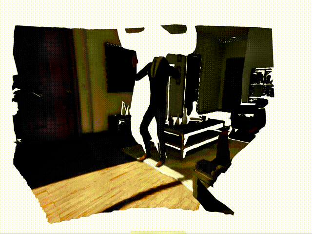

# Video2Mesh
This project looks at creating a 3D video from a RGBD video.

# Getting Started
## Setting Up Python
Start by choosing on of the following methods for setting up the Python environment:
1. Conda

    You can install all the required Python dependencies with [Conda](https://docs.conda.io/en/latest/miniconda.html):
    ```shell
    conda env create -f environment.yml
    conda activate video2mesh
    ```

2. PIP - CPU Only
    ```shell
    pip install -r requirement.txt
    pip install torch==1.10.0+cpu torchvision==0.11.1+cpu -f https://download.pytorch.org/whl/cpu/torch_stable.html
    pip install detectron2 -f https://dl.fbaipublicfiles.com/detectron2/wheels/cpu/torch1.10/index.html
    ```

3. PIP - CUDA (11.3)
    ```shell
    pip install -r requirement.txt
    pip install torch==1.10.0+cu113 torchvision==0.11.1+cu113 -f https://download.pytorch.org/whl/cpu/torch_stable.html
    pip install detectron2 -f https://dl.fbaipublicfiles.com/detectron2/wheels/cuda113/torch1.10/index.html
    ```
   
4. Docker - CPU Only
   
   Either:
     1. Pull (download) a pre-built image (~600 MB): 
        ```shell
        docker pull eight0153/video2mesh:cpu
        ```
     2. Build the Docker Image:
    
        ```shell
        docker build -t eight0153/video2mesh:cpu .
        ```
        **Note:** For M1 Macs you should specify an amd64 image:
        ```shell
        docker buildx build --platform linux/amd64 -t eight0153/video2mesh:cpu .
        ```
        It is important to do this as not all the required packages have arm64 pre-built binaries available.

6. Docker - CUDA (11.3)

   Either:
     1. Pull (download) a pre-built image (~7.2 GB): 
        ```shell
        docker pull eight0153/video2mesh:cu113
        ```
     2. Build the Docker Image:
    
        ```shell
        docker build -f Dockerfile-cu113 -t eight0153/video2mesh:cu113 .
        ```

## Running the Program
### Sample Dataset
You can download a sample dataset from [here](https://www.icloud.com/iclouddrive/0AVLFLkxIy_M3Pm-u8aopXHHQ#dance).
Assuming you have downloaded the dataset archive to the root of this repo, you can extract the archive to the right 
folder via the following:
```shell
mkdir -p data/
tar -xvzf dance.tar.gz -C data/
```
### Example Usage
Below is an example of how to run the program:
```shell
python Video2mesh/video2mesh.py --base_dir data/dance --num_frames 10 --max_depth_dist 0.1 --include_background --static_background --overwrite_ok
```

 **Note:** Creating the instance segmentation masks with a CPU only image/Python environment will be *VERY* slow. 
 It is strongly recommended that you use a GPU image/environment if possible.

### CLI Parameters
If you want help with the CLI and the options, you can either refer to the source code or view the help via:
```shell
python Video2mesh/video2mesh.py --help
```

### Docker
The Docker containers will, by default, bring up the python interpreter.
All you need to do to get the main script (or any other script) running is to append the usual command, 
minus the call to python, to the following:
```shell
docker run -v $(pwd)/data:/app/data -v $(pwd)/Video2mesh:/app/Video2mesh -t eight0153/video2mesh:<cpu|cu113> 
```
making sure to choose the right tag for the image (`cpu` or `cu113`).
For example: 
```shell
docker run -v $(pwd)/data:/app/data -v $(pwd)/Video2mesh:/app/Video2mesh -t eight0153/video2mesh:cpu -c "print('Hello, world!')"
```

### Viewing the 3D Video
Refer to the [WebXR repo](https://github.com/eight0153/webxr3dvideo).

## Input Data Format
This program expects a specific data format, as illustrated below:

```
<project root>
│   ...
│
└───data
│   │
│   └───<dataset 1>
│   │   │   camera.txt
│   │   │   trajectory.txt
│   │   │   colour
│   │   │   depth
│   │   │   [mask]
│   │
│   └───...
│   │
│   └───<dataset n>
└───...
```

Datasets should be placed in a folder inside the `data/` folder.
Generally, the number of colour frames must match the number of depth maps, masks and lines in the camera trajectory 
file.
Within each dataset folder, there should the 4-5 items:
1. The camera intrinsics in a text file in the following format:
   ```text
   fx  0 cx
    0 fy cy
    0  0  1
   ```
   where `fx`, `fy` are the focal length (pixels) and `cx`, `cy` the principal point.
2. The camera trajectory in a text file in the following format:
   ```text
   rx ry rz tx ty tz
   ...
   rx ry rz tx ty tz
   ```
   where: `rx`, `ry` and `rz` form a rotation vector (axis-angle, magnitude is angle in radians); and `tx`, `ty` and `tz` form a translation vector.
   There must be one line per frame in the input video sequence.
   Absolute pose values are expected (i.e. all relative to world origin).
3. The colour (RGB) frames, either JPEG or PNG, in a folder with names that preserve the frames' natural ordering, e.g.:
   ```text
   colour
   │   0001.jpg
   │   0002.jpg
   │   ...
   └───9999.jpg
   ```
4. The depth maps (either JPEG, PNG, or .raw) in a folder with names that preserve the frames' natural ordering, e.g.:
   ```text
   depth
   │   0001.jpg
   │   0002.jpg
   │   ...
   └───9999.jpg
   ```
   The depth maps are expected to be stored in a 8-bit unsigned image.
   Each depth map should have their original values divided by the maximum observed depth value from the *entire* video sequence:
   ```depth_map_i = depth_map_i / max_depth```. Depth values should be increasing from the camera (i.e. depth = 0 at the camera),
   and go up to a maximum value that is defined as a command line argument. For example, if the maximum depth is 10, `--max_depth 10.0`.
   The units roughly correspond to meters.
5. Optionally, the instance segmentation maps (either JPEG or PNG, single channel) in a folder with names that preserve the frames' 
natural ordering, e.g.:
   ```text
   mask
   │   0001.jpg
   │   0002.jpg
   │   ...
   └───9999.jpg
   ```
   Each mask should encode each instance (up to 255) where each instance
   is assigned the same 8-bit number for the entire sequence.
   The background (i.e. areas with no instances) should be indicated with zero in the masks.

   **Note:** If you do not have the instance segmentation masks, you can create the masks by adding the
   CLI flag `--create_masks` when you run the program.

## Output Format
The generated meshes are saved into a single glTF formatted file.
Each mesh in the glTF file represents the mesh for all objects for a given frame.