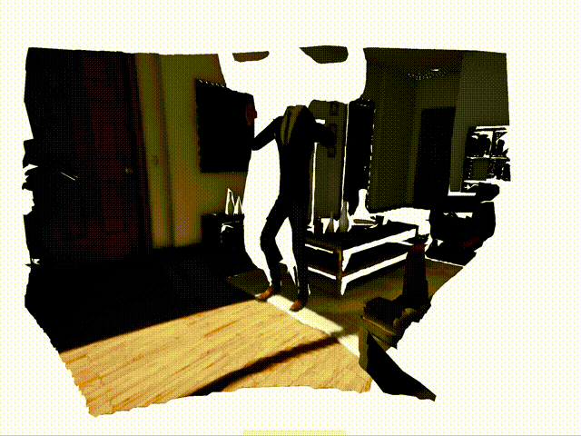
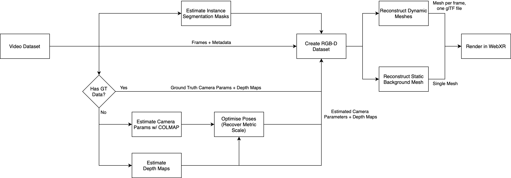
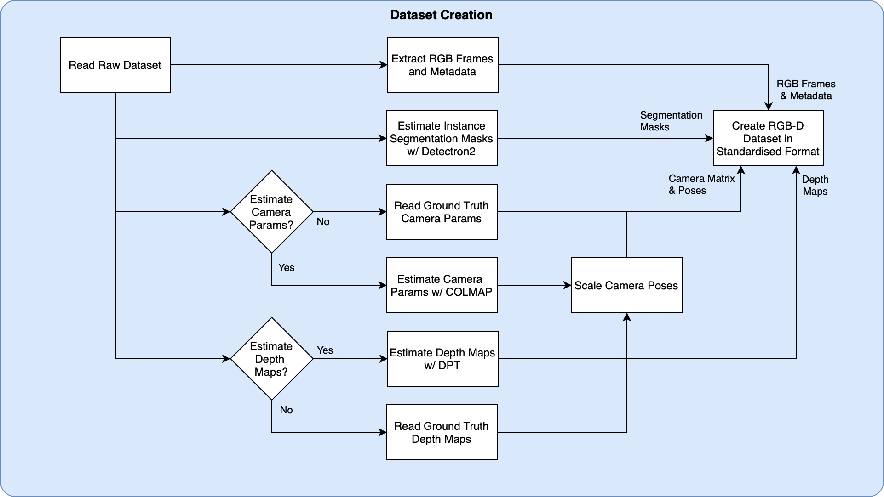
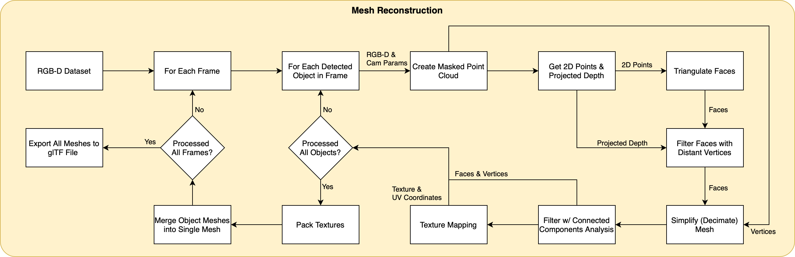
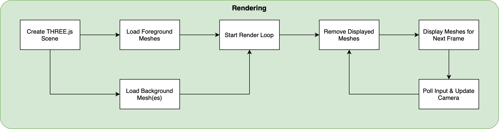
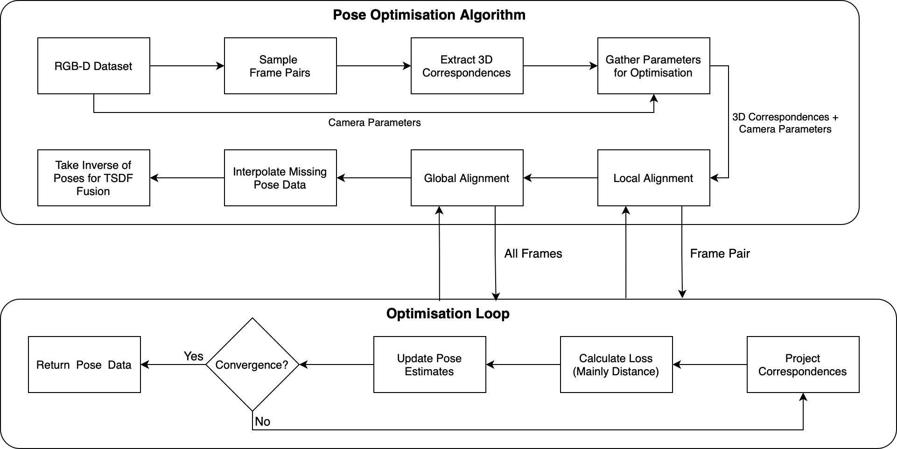

# Video2Mesh
This project looks at creating a 3D video from an RGB-D (red, green, blue and depth) video.


# Getting Started
## System Requirements
- Windows or Ubuntu
- WSL for Windows users
- CUDA 11.6+
- Docker
- NVIDIA GPU with 6GB+ memory, e.g. RTX 2080 Ti, RTX 3060.
- 16GB of RAM

## Cloning the Project
Clone the repo:
```shell
git clone --recurse-submodules https://github.com/AnthonyDickson/video2mesh.git 
```
If you forget to or cannot clone with `--recurse-submodules`, then clone the git dependencies with the following:
```shell
git submodule update --init --recursive
```
This command can also be used to pull/update any changes in the submodules. 

## Quickstart
Here are the steps to quickly run a video.
1. Create a folder in the repository root that contains your videos or RGB-D datasets (TUM, Unreal or StrayScanner).
2. Create a folder in the repository root to store the outputs.
3. Run the following command in a terminal from the repository root:
    ```shell
    PORT_NUMBER=8081; docker run --name HIVE --rm --gpus all -p ${PORT_NUMBER}:${PORT_NUMBER} -v $(pwd):/app -it dican732/video2mesh:latest python3 -m video2mesh.interface --port ${PORT_NUMBER}
    ```
4. Navigate to http://localhost:8081 and fill in `dataset_path` and `output_path` with the dataset path and output folder you created in steps 1 and 2, and click the button at the bottom of the page that says 'Start Pipeline'. 
   You can leave the other settings at their default values.
   For long videos, you can set `num_frames` to something like 150 to make it run faster.
   For datasets with ground truth data, uncheck `estimate_pose` and/or `estimate_depth` to use the ground truth data.
5. In another terminal, start the web viewer:
   ```shell
   docker run--name WebXR-3D-Video-Viewer --rm  -p 8080:8080 -v $(pwd)/third_party/webxr3dvideo/src:/app/src:ro -v $(pwd)/third_party/webxr3dvideo/docs:/app/docs dican732/webxr3dvideo:node-16  
   ```
6. After the pipeline has finished running, check the first terminal you opened for a link. Navigate to that link in your web browser to view the 3D video.

**Note:** Oculus headset users can use desktop mode in Oculus Link to view the 3D video in VR.
Run the steps above as normal, and at the end click the button at the bottom of the screen saying 'Enter VR' from your headset. 


## Setting Up Your Development Environment
Choose one of three options for setting up the dev environment (in the recommended order):
1. [Pre-built Docker image](#pre-built-docker-image)
2. [Building the Docker image locally](#building-the-docker-image-locally)
3. [Local installation](#local-installation)

### Pre-Built Docker Image
1. Pull (download) the pre-built image (~18 GB): 
      ```shell
      docker pull dican732/video2mesh:runtime-cu118
      ```
   **Note:** This image is just running the pipeline. If you want to run the more experimental code (e.g., Bundle Fusion, other depth estimation models) you will need to use the development image `dican732/video2mesh:dev-cu118`.

2. Done! Go to [Running the Program](#running-the-program) for basic usage.

### Building the Docker image locally
1. Run the build command:
      ```shell
      docker build -f Dockerfile.dev -t dican732/video2mesh .
      ```

2. There are some custom CUDA kernels that require GPU access to be built. These can be installed via the following command: 
    ```shell
    docker run --rm -v $(pwd):/app -it dican732/video2mesh bash -c "cd thirdparty/consistent_depth/third_party/flownet2/ && chmod +x install.sh && ./install.sh && bash"
    ```
  
3. Once this command has finished and the container is ***still running***, run the following command to update the Docker image with the newly installed Python packages: 
    ```shell
    IMAGE_NAME=dican732/video2mesh
    CONTAINER_ID=$(docker ps | grep ${IMAGE_NAME} | awk '{ print $1 }')
    docker commit $CONTAINER_ID $IMAGE_NAME
    ```
     
4. You can now exit the Docker container started in step 2.

5. Done! Go to [Running the Program](#running-the-program) for basic usage.

### Local Installation
1. Install Python 3.8. A virtual environment (e.g., Conda, virtualenv, pipenv) is recommended.

2. Install the Python packages:
    ```shell
    pip install -r requirements.txt
    ```
3. Ensure that you have installed the following:
   - CUDA Toolkit 11.6+
   - OpenCV 3.4.16 
     - Make sure to enable the CMake flag `-DWITH_CUDA=true`.
   - COLMAP
  
   Refer to [Dockerfile](Dockerfile) for detailed setup instructions on Ubuntu 20.04.

4. Done! Go to [Running the Program](#running-the-program) for basic usage.

## Running the Program
### Sample Dataset
You can download a sample dataset from the [TUM website](https://vision.in.tum.de/data/datasets/rgbd-dataset/download).
The sequence `fr3/walking_xyz` is a good one to start with.
Make sure you download and extract the dataset to the `data/` folder.

### Example Usage
Below is an example of how to run the program with ground truth data and a static background:
1. Local Python:
    ```shell
    python -m video2mesh --dataset_path data/rgbd_dataset_freiburg3_walking_xyz --output_path data/rgbd_dataset_freiburg3_walking_xyz_output --num_frames 150
    ```

2. Docker:
    ```shell
    docker run --rm --gpus all -v $(pwd):/app -it dican732/video2mesh python3 -m video2mesh --dataset_path data/rgbd_dataset_freiburg3_walking_xyz --output_path data/rgbd_dataset_freiburg3_walking_xyz_output --num_frames 150
    ```

Below is an example of how to run the program with estimated data and a static background:
1. Local Python:
    ```shell
    python -m video2mesh --dataset_path data/rgbd_dataset_freiburg3_walking_xyz --output_path data/rgbd_dataset_freiburg3_walking_xyz_output --num_frames 150 --frame_step 15 --estimate_pose --estimate_depth
    ```

2. Docker:
    ```shell
    docker run --rm --gpus all -v $(pwd):/app -it dican732/video2mesh python3 -m video2mesh --dataset_path data/rgbd_dataset_freiburg3_walking_xyz --output_path data/rgbd_dataset_freiburg3_walking_xyz_output --num_frames 150 --frame_step 15 --estimate_pose --estimate_depth
    ```

### PyCharm Users
There should be run configurations for PyCharm included when you clone the repo from GitHub in the `.idea` folder.

### CLI Options
If you want help with the CLI and the options, you can either refer to the source code or view the help via:
1. Local Python:
    ```shell
    python -m video2mesh --help
    ```

2. Docker:
    ```shell
    docker run --rm -v $(pwd):/app -it dican732/video2mesh python3 -m video2mesh --help
    ```

### Common CLI Options
- `--dataset_path <path/to/dataset>` Specify the path to either: a video file, TUM dataset or an iPhone dataset (StrayScanner).
- `--output_path <path/to/folder>` Specify where the results should be written to.
- `--overwrite_ok` Allow existing video files in `output_path` or the WebXR export path to be overwritten.
- `--no_cache` By default the pipeline will use any cached converted datasets in `output_path`. Use this flag to automatically delete any cached datasets.
- `--estimate_depth` By default the pipeline will try to use any depth maps in the `depth` folder. Use this flag to use estimated depth maps instead.
- `--estimate_pose` By default the pipeline will try to use ground truth camera intrinsics matrix and poses in the `camera_matrix.txt` and `camera_trajectory.txt` files. Use this flag to use COLMAP to estimate the camera parameters instead.
- `--num_frames <int>` If specified, any frames after this index are truncated. **Note:** COLMAP will still be given every frame (before applying `--frame_step`). 
- `--webxr_add_sky_box` Adds a sky box to the video in the renderer.
- `--align_scene` Whether to align the scene with the ground plane. Enable this if the recording device was held at an angle (facing upwards or downwards, not level) and the scene is not level in the renderer. This setting is recommended if you are using estimated pose.
- `--inpainting_mode` Use Lama to inpaint the background.
    - `0` - no inpainting.
    - `1` - Depth: cv2, Background: cv2
    - `2` - Depth: cv2, Background: LaMa
    - `3` - Depth: LaMa, Background: cv2
    - `4` - Depth: LaMa, Background: LaMa
- `--use_billboard` Creates flat billboards for foreground objects. This is intended as a workaround for cases where the estimated depth results in stretched out meshes with missing body parts.
- `--static_camera` Indicate that the camera was not moving during capture. This will use the Kinect sensor camera matrix and the identity pose for the camera trajectory. Note: You do not need the flag `--estimate_pose` when using this flag.

### Docker
The Docker containers will, by default, bring up the python interpreter. All you need to do to get the main script (or any other script) running is to append the usual command, minus the call to python, to the following:
```shell
docker run --rm --gpus all -v $(pwd):/app -it dican732/video2mesh 
```
For example, if you wanted to test whether the container is CUDA enabled: 
```shell
docker run --rm --gpus all -v $(pwd):/app -it dican732/video2mesh python3 -c "import torch; print(torch.cuda.is_available())"
```

### Gradio Web Interface
You can run the pipeline from a web based interface instead of the CLI.
Assuming you are using Docker, you can run this by running the following command:
```shell
docker run -v $(pwd):/app -p 0.0.0.0:8081:8081 --rm --gpus all -it dican732/video2mesh:runtime-cu118 python3 -m video2mesh.interface
```
and navigating to `localhost:8081`.
Note that if you are using Docker, the dataset path and output paths should be relative to the project root folder.

Thank you to Felix for implementing this web interface and the image inpainting.

### Viewing the 3D Video
- Start the Docker container:
   ```shell
   docker run --rm  --name WebXR-3D-Video-Server -p 8080:8080 -v $(pwd)/third_party/webxr3dvideo/src:/app/src:ro -v $(pwd)/third_party/webxr3dvideo/docs:/app/docs dican732/webxr3dvideo:node-16 
   ```
  or if you are using PyCharm there is a run configuration included.
- When you run the pipeline it will print the link to view the video.
- The renderer using orbit controls where:
  - Left click + dragging the mouse will orbit.
  - Right click + dragging the mouse will pan.
  - Scrolling will zoom in and out.
  - `<space>`: Pause/play the video.
  - `C`: Reset the camera's position and rotation.
  - `G`: Go to a particular frame.
  - `L`: Toggle whether to use camera pose from metadata for XR headset.
  - `P`: Save the camera's pose and metadata to disk.
  - `R`: Restart the video playback.
  - `S`: Show/hide the framerate statistics.

Refer to the [WebXR repo](https://github.com/AnthonyDickson/webxr3dvideo) for the code.

# Data Format
## Input Data Format
This program accepts datasets in three formats:
- TUM [RGB-D SLAM Dataset](https://vision.in.tum.de/data/datasets/rgbd-dataset/file_formats)
- RGB-D datasets created on an iOS device using [StrayScanner](https://apps.apple.com/nz/app/stray-scanner/id1557051662)
- RGB Video
- The VTM format (see [VTM Dataset Format](#vtm-dataset-format))

The above datasets are automatically converted to the VTM format.

## Output Format
Each 3D video is saved to a folder with the glTF formatted mesh files and JSON metadata:
```text
<converted dataset>
│   ...
└── mesh
    │   fg.glb
    │   bg.glb
    └── metadata.json
```
This folder is saved under the dataset folder.


## VTM Dataset Format
Overall, the expected folder structure for the VTM format is as follows:

```
<dataset>
│   metadata.json
│   camera_matrix.txt
│   camera_trajectory.txt
│   rgb
│   │   000000.png
│   │   000001.png
│   │   ...
│   └── 999999.png
│   depth
│   │   000000.png
│   │   000001.png
│   │   ...
│   └── 999999.png
│   mask
│   │   000000.png
│   │   000001.png
│   │   ...
│   └── 999999.png
└── ...
```

Datasets should be placed in a folder inside the `data/` folder.
Generally, the number of colour frames must match the number of depth maps, masks and lines in the camera trajectory file.
Within each dataset folder, there should be the following 5 items:
1. The metadata in a JSON formatted file that contains the following fields:
   - `num_frames`: The number of frames in the video sequence.
   - `frame_step`: The frequency in frames to sample frames for COLMAP and pose optimisation.
   - `fps`: The framerate of the video.
   - `width`: The width of the video frames in pixels.
   - `height`: The height of the video frames in pixels.
   - `depth_scale`: A scalar that when multiplied with depth map, will transform the depth values to meters.
   - `max_depth`: Depth values are clipped to this value. Roughly corresponds to meters.
   - `depth_mask_dilation_iterations`: The number of times to apply the dilation filter to the dynamic object masks when creating the masked depth maps.
   - `is_gt`: Whether the dataset was created using ground truth camera and depth data.
   - `estimate_pose`: Whether the camera parameters were estimated with COLMAP.
   - `estimate_depth`: Whether the depth maps were estimated.
   - `colmap_options`: The COLMAP configuration that was used if `estimate_pose` was `True`. This is a nested dictionary that contains the following fields:
     - `binary_path`: The path to the COLMAP binary.
     - `vocab_path`: The path to the COLMAP vocab file.
     - `is_single_camera`: Whether the dataset was captured with a single camera.
     - `dense`: Whether to run the dense reconstruction.
     - `quality`: The preset to use for the automatic reconstruction pipeline.
2. The camera intrinsics in a text file in the following format:
   ```text
   fx  0 cx
    0 fy cy
    0  0  1
   ```
   where `fx`, `fy` are the focal length (pixels) and `cx`, `cy` the principal point.
3. The camera trajectory in a text file in the following format:
   ```text
   qx qy qz qw tx ty tz
   ...
   qx qy qz qw tx ty tz
   ```
   where: `qx`, `qy`, `qz` and `qw` form a quaternion; and `tx`, `ty` and `tz` form a translation vector.
   There must be one line per frame in the input video sequence.
   Absolute pose values are expected (i.e. all relative to world origin) that transform points in world coordinates to camera space.
4. The colour (RGB) frames are PNG files in a folder with names that preserve the frames' natural ordering, e.g.:
   ```text
   rgb
   │   000001.png
   │   000002.png
   │   ...
   └── 999999.png
   ```
5. The depth maps are 16-bit PNG files in a folder with names that preserve the frames' natural ordering, e.g.:
   ```text
   depth
   │   000001.png
   │   000002.png
   │   ...
   └── 999999.png
   ```
   The depth maps are expected to be stored in a 16-bit grayscale image. The depth values should be in millimeters and increasing from the camera (i.e. depth = 0 at the camera, depth of 1000 is 1000 millimeters).


# Algorithm Overview
## Pipeline


## Dataset Creation


## Mesh Reconstruction

Background mesh reconstruction uses [TSDFFusion](https://github.com/andyzeng/tsdf-fusion-python) by default, but it can also use the above method if the user requests it.

## WebXR Renderer


## Pose Optimisation (Obsolete)
